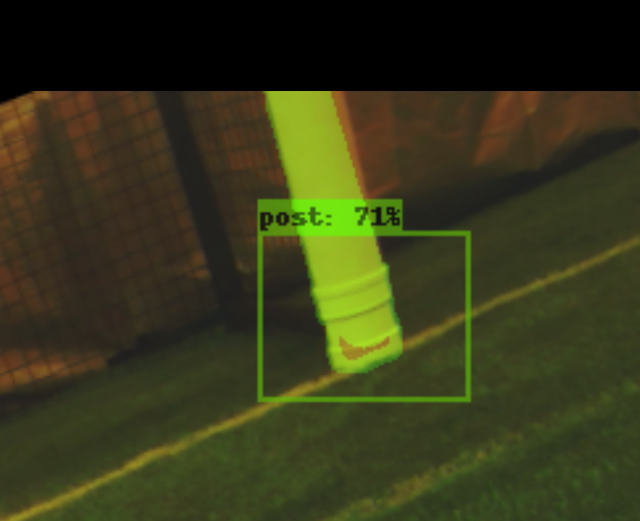
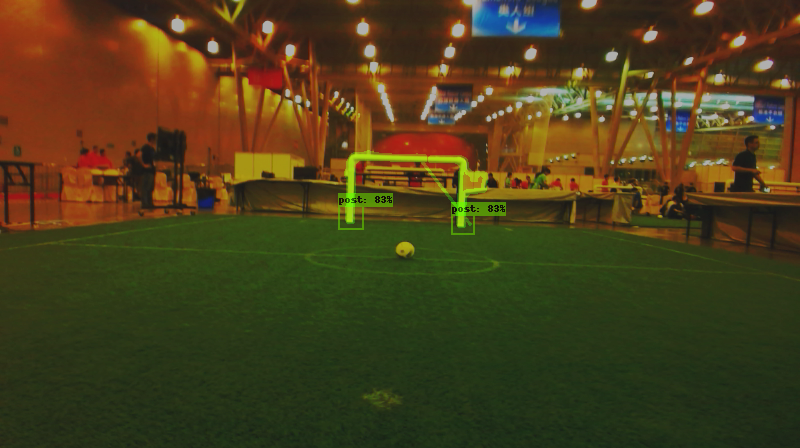

# TS341 Détection des buts

Dans le cadre du projet d'outils d'imagerie pour la robotique, nous avons pour objectif la reconnaissance du but sur un terrain de foot dans le cadre de la Robocup.

## Membres

- BARRAIS Marius 
- BRISSAUD Cloé
- CONSTANS PROTOPAPPAS Théa
- DELPEUCH Sébastien 

## Installation

Pour utiliser le projet il est aussi nécessaire d'avoir tensorflow 2.6 installé sur la machine. Tous les packages d'une environnement virtuel utilisé pour utiliser le projet sont présent dans `requirements.txt`.

Pour simplement l'utiliser il est nécessaire d'activer l'environnement virtuel et de décompresser `tod_tf2.zip`. Les résultats de l'entrainement du réseau sont dans [object_detection](object_detection/training/ssd_mobilnet/saved_model3).

Pour simplement voir les résultats du projet : [process](process1)

Pour executer le projet sur une image : `python3 main.py photo <name>.png` où `name` est le nom d'une image dans le dossier `data`. L'image enregistrée sera dans le dossier `process`.

Pour executer le projet sur le dossier data : `python3 main.py folder`. Les images traitées seront dans le dossier `process`.

Pour tout problème d'installation n'hésitez pas à nous contacter.

Le dossier `data` contient les images à traiter, le dossier `process` est un dossier recevant les images après traitement, le dossier `process1` est une sauvegarde des résultats du projet. Le dossier `object_detection` contient les résultats du réseau après entrainement.

Le fichier `main.py` est le fichier principal du projet permettant d'exécuter le projet avec les commandes ci dessus. Le fichier `data.py` permet de représenter les données, `data_processing.py` de réaliser le traitement d'image classique et `deep_learning_processing.py` de réaliser la prédiction du réseau de neurone sur une image.

Ce projet nécessite d'avoir l'api TOD pour réentrainer le réseau si nécessaire, pour l'installer : [ROS4PRO TOD](https://learn.e.ros4.pro/fr/vision/object_detection_tf2/tod_install/)

## Chaine de traitement globale

Notre chaine de traitement est composée de plusieurs modules. D'une part nous avons un réseau de neurones permettant de détecter un but dans une image. D'autre part nous avons du traitement de l'image classique pour segmenter le but puis de le reconstruire à travers cette image. L'utilisation de ce pipeline dans des conditions initiales est résumé dans la figure suivante.

## Utilisation d'un réseau de neurones pour trouver les buts

Pour ce faire, nous avons utilisé le deep learning pour la détection d'objet dans une image. Nous allons utiliser des réseaux de neurones déjà entrainés de la famille des réseaux convolutionnels : le MobilNet v2. Ces réseaux sont déjà pré-entrainées sur le dataset COCO. Ce sont des algorithmes de détection d'objets qui segmentent l'image d'entrée pour trouver des zones délimitantes pertinentes, puis fait tourner un algorithme de détection pour trouver les objets les plus probables d'apparaître dans ces zones délimitantes. C'est un réseau de neurones trés fiable et robuste, c'est pour cette raison que nous nous sommes tournées vers ce genre de réseaux. Il va permettre d'extraire des images les regions les plus susceptibles de contenir un objet (c'est à dire une zone d'interet). Pour chacune des zones d'intérêts, une boîte englobantes va être générée. Ces boites vont être classifiées et selectionnées en fonction de leurs probabilités de contenir l'objet.   

En entrée, il est donné à l'algorithme 579 images toutes labellisées par nos soins, issues des images données au début du projet. La moitié des images sont tournée de 20° (angle déterminé compte tenu des limites physique des robots sigma d'où proviennent les images) afin d'augmenter le nombre d'images en entrée : 80% sont utilisée en train (= permet d'entrainer le modèle) et 20% en test (= permet de mesurer l'erreur du modèle final sur des données inconnues). 

Un exemple d'image labélisée :  

Nous avons décidé de détecter le bas des poteaux de but et non tout le but entier. En effet, sur certaines données il n'y a qu'un bout du but (1 poteau ou 2 poteaux sans le haut du but) mais il faut quand même détecter que cela est un but. Nous avons donc décidé de détecter le bas des poteaux puis nous recadrons la photo par rapport aux positions des boites englobantes détecté sur l'image. 

En sortie de cet algorithme, nous avons donc une image recadrée sur le but et la position (x,y) de(s) poteau(x) par rapport à l'image d'origine.  

L'entrainement de ce réseau avec notre dataset ce fera grâce à l'API TOD TF2 (qui utilise TensorFlow 2) que vous pouvez trouver [ici](https://github.com/cjlux/tod_tf2_tools).

Les résultats du réseau sont les suivants : 
1. Pour un poteau (39 images testées) l'algorithme ne produit aucun faux, la probabilité moyenne de détection est de 72% et la pire est de 38%
2. Pour 2 poteaux (57 images) l'algorithme ne produit 1 faux positif et aucun faux négatif avec une moins bonne conficnace à 29%

Une métrique supplémentaire à été mise en place dans le cas des images possédant 1 poteau : _intersection over union_, cette métrique renseigne sur la qualité de la position de la boite englobante. Sur les images possédant 1 poteau nous obtenons une _IoU_ moyenne de 0.72. 

Cela termine la première partie de notre pipeline nous permettant de détecter la position de(s) poteau(x) avec un nombre de faux limité et la position de ces poteaux (cruciale pour la suite du pipeline) est bonne.

## Traitement de l'image pour segmenter les buts

L'entrée de cet algorithme récupère la sortie du précédent (c'est à dire une image recentrée sur le(s) poteau(x) ainsi que la position (x,y) des poteaux dans l'image d'origine) et a pour objectif de segmenter et reconstruire le but. Cette segmentation utilise du traitement de l'image classique plus précisément : 

Dans premier temps l'image est convertie en niveau puis un seuillage est utilisé pour binariser l'image. 

En binarisant l'image nous nous retrouvons avec le but d'une part mais aussi des artéfacts du décors qui bruitent l'image. Pour réduire ces bruits nous allons commencer par supprimer les artéfacts les plus petits en appliquant une erosion puis un filtre médian. 

Après avoir éliminé les artéfacts de petite taille il reste encore isoler le but. Pour cela nous détectons les contours de l'image grâce à l'algorithme Canny. 

Pour isoler le but de l'image nous allons chercher le contour ayant la plus grande aire possible, pour ce faire nous détectons tout d'abord les composantes connexes de l'image. Parmi ces composantes connexes nous choisissons celle ayant l'aire la plus grande qui correspond à un but. 

En supperposant cette aire avec l'image initiale nous avons une détection du périmètre / aire du but

La détection du périmètre du but a été testée sur 96 images et détecte correctement les contours dans 77% des cas. Dans 19% des cas le périmètre est partiellement détecté (moins de 50% du périmètre détecté) et dans 4% des cas l'algorithme échoue totalement (aucune détection, détection d'un autre objet que le but, moins de 10% du périmètre détecté).

### Reconstruction des lignes directrices

Une fois que le périmètre des buts est détecté nous souhaitons construire les lignes directrices des buts, nous réalisons ça mathématiquement en distinguant 3 cas. Dans tous les cas nous disposons de la base des poteaux grâce au réseau de neurones précédent.
1. **Un seul poteau** : dans ce cas nous prenons le périmètre détecté par le premier traitement, nous parcourons verticalement l'image jusqu'à trouver une densité de blanc suffisante (au moins 4 pixel blanc sur une ligne). Nous trouvons ensuite sur la ligne le début (parcours en partant de la gauche) et la fin (parcours en partant de la droite) du but. Nous trouvons alors le centre du poteau (en x) et sa hauteur (en y). Étant donné que nous avons la position d'origine du poteau il suffit de relier les deux

2. **Deux poteaux** : le processus pour deux poteaux est le même que celui pour un, cependant lorsque deux poteaux sont à reconstruire on coupe l'image en deux puis on applique l'algorithme permettant de trouver un poteau aux deux moitiés de l'image. 
3. **Le but** : le but se reconstruit comme 2 poteaux mais la hauteur du but se détecte avec une densité de pixel blanc plus forte (plus de 50% de la ligne)

Les algorithmes de reconstructions ont été testés sur les mêmes 96 images que précedemment. Ceux ci donnent des résultats mitigés : 40.6% des buts sont correctement reconstruits, 9.4% le sont partiellement, 16.7% conduisent à des abérations et dans 33.3% des cas l'algorithme n'essaye pas de reconstruire le but. 

Ces résultats mitigés sont le fruit de la méthode mathématiques employée. En effet cette méthode est particulièrement efficace pour reconstruire les buts en entier mais dépend énormément de la qualité du périmètre détecté. Une voie d'amélioration de cette parte serait de détecter soit les coins du buts pour en construire les lignes directrices soit d'appliquer une transformée de Hough pour trouver les lignes directrices et ensuite déterminer le but.

## Conclusion 

En somme nous avons un _pipeline_ permettant de résoudre l'un des problèmes rencontré pendant la Robocup avec les robots Sigma : trouver la position des buts pour pouvoir viser entre les deux poteaux. Cette simple détection via notre pipeline est fiable. Cette détection n'est pas actuellement embarquable directement sur les robots pour traiter des images en direct. Elle serait cependant embarquable après quelques modifications qui dépassent le cadre de ce projet ou peuvent être utilisé via un serveur de traitement central de manière analogue à ce qui est fait en ligue SSL.

Concernant la segmentation, l'algorithme final est fiable, cependant la reconstruction des lignes directrices est améliorable.
