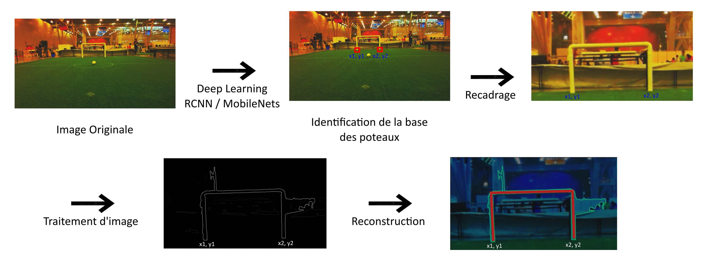
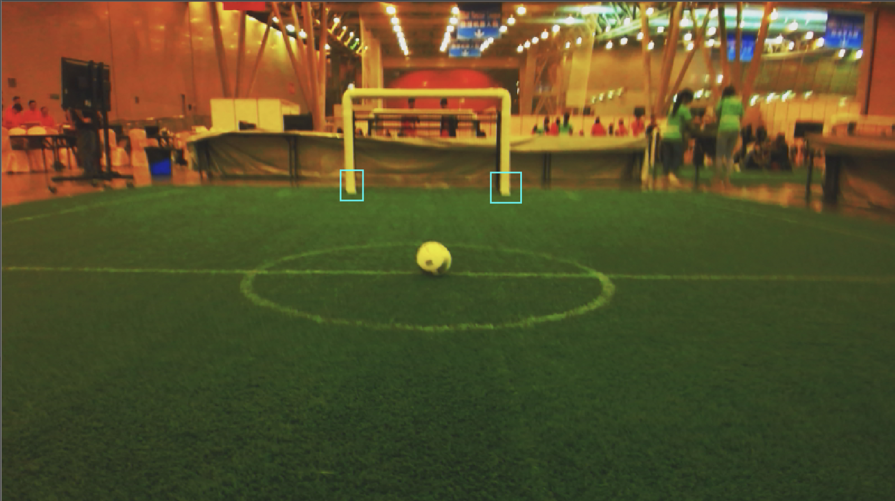
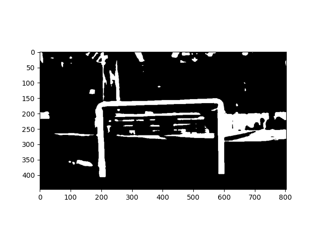
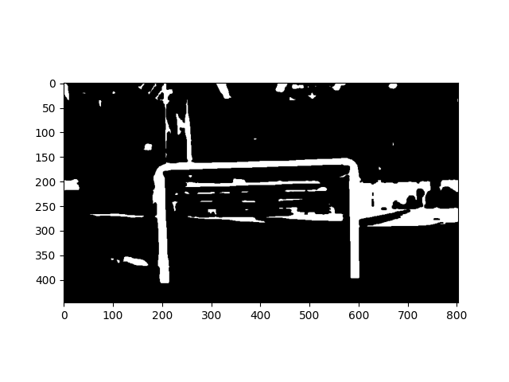
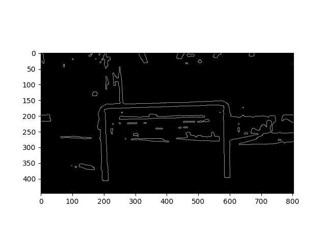
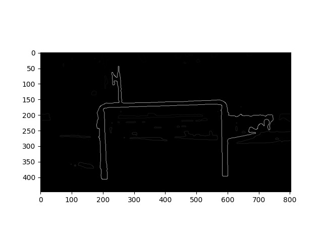
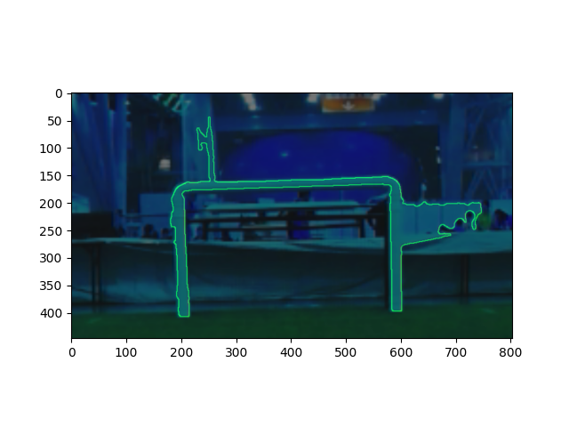

# TS341 Détection des buts

Dans le cadre du projet d'outils d'imagerie pour la robotique, nous avons pour objectif la reconnaissance du but sur un terrain de foot dans le cadre de la Robocup.

## Chaine de traitement globale

Notre chaine de traitement prévisionnelle est composée de plusieurs modules. D'une part nous avons un réseau de neuronne permettant de détecter un but dans une image. D'autre part nous avons du traitement de l'image classique pour segmenter le but à travers cette image. Ce pipeline est résumé par la figure suivante.



## Utilisation d'un réseau de neuronne pour trouver les buts

Dans le cadre du projet d'outils d'imagerie pour la robotique, nous avons pour objectif la reconnaissance du but sur un terrain de foot. Pour ce faire, nous avons utilisé le deep learning pour la détection d'objet dans une image. Nous allons utiliser des réseaux de neurones déjà entrainés de la famille des réseaux convolutionnels : le R-CNN ou le MobilNet.  Ces réseaux sont déjà pré-entrainées sur le dataset COCO. Le R-CNN est un algorithme de détection d'objet qui segmente l'image d'entrée pour trouver des zones délimitantes pertinentes, puis fait tourner un algorithme de détection pour trouver les objets les plus probables d'apparaître dans ces zones délimitantes. R-CNN est un réseau de neurones trés fiable et robuste, c'est pour cette raison que nous nous sommes tournées vers ce genre de réseaux. Il va permettre d'extraire de l'images les regions les plus suceptibles de contenir un objet(=zone d'interets).Pour chacune des zones d'interets, une boîte englobantes va être générés. Ces boites vont être classifiées et selectionnées en fontions de leurs probabilités de contenir l'objets.   
En entrée, il est donné à l'algorithme 579 images toutes labélisée par nos soins, issues des images données au début du projet.  
Un exemple d'image labélisé :  

La moitié des images sont tournée de 20° afin d'augmenter le nombre d'image en entrée : 20% sont utilisée en train (= permet
d'entrainer le modèle) et 80% en test (= permet de mesurer l'erreur du modele final sur des données inconnues).

En sortie de cette algorithme nous avons donc une image recadrée sur le but et la position (x,y) de(s) poteau(x) par rapport à l'image d'origine.  

L'entrainement de ce réseau avec notre dataset ce fera grâce à l'API TOD TF2 (qui utilise TensorFlow 2) que vous pouvez trouver [ici](https://github.com/cjlux/tod_tf2_tools).

## Traitement de l'image pour segmenter les buts

L'entrée de cet algorithme récupère la sortie du précédent et a pour objectif de segmenter et reconstruire le but. Cette segmentation utilise du traitement de l'image classique plus précisément :

```
fonction segmentation_goal(image):
    # Conversion de l'image en noir et blanc en utilisant cv2.threshold(img, 150, 255, cv2.THRESH_BINARY)
    gray_scale(img) 
    
    # Érosion de l'image
    erode(img, kernel = (2,2))
    
    # Application d'un filtre médian
    median(img, k = 5)
    
    # Détection des contours en utilisant Canny
    contours(img, 100, 200)
    
    # Détection des composantes connexes (cv2.connectedComponents) et selection du contour ayant l'aire la plus grande
    max_area_components(img)
    
    # Reconstruction du but 
    reconstruct_goal(img, (x_1, y_1), (x_2, y_2))
    
    # Supperposition du but sur l'image originale
    superpose(img, mask)
```

Un exemple d'éxécution de chaque étape est disponible dans le dossier readme_images.








Lors de l'écriture de cette milestone tous les algorithmes permettant le traitement d'image sont fonctionnels hormis reconstruct_goal. L'algorithme général est executable en réalisant la commande `python3 main.py`.
